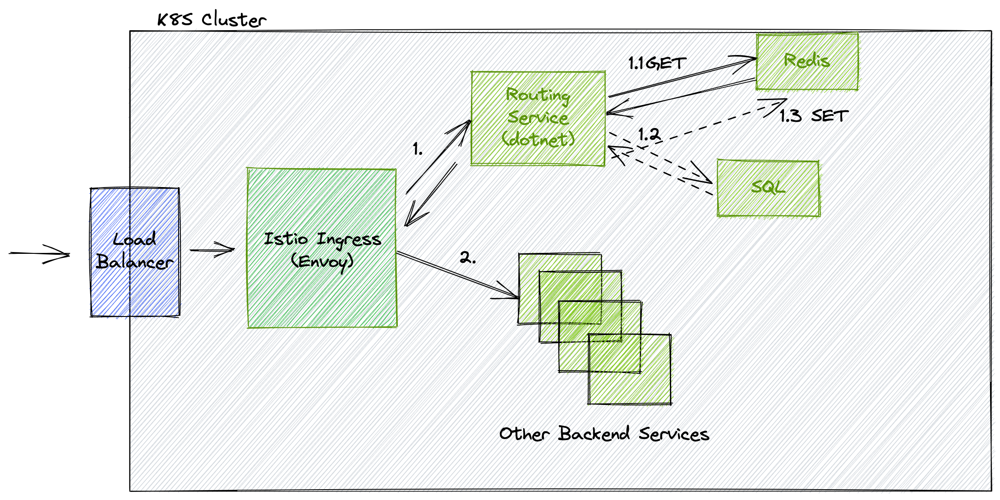
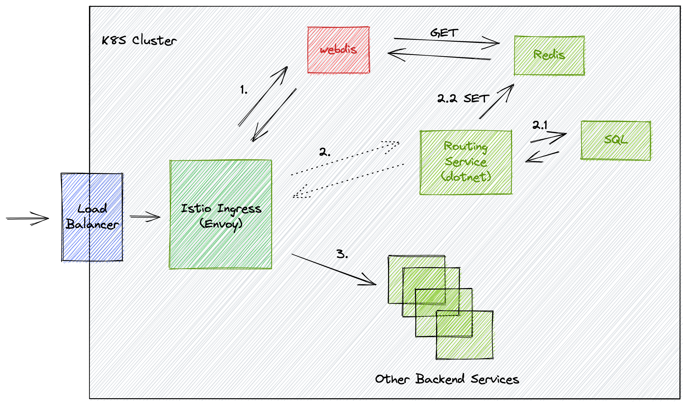

# Demo of integrating Webdis with Istio

## Context
We have a specific routing requirement that cannot be achieved by simply using Istio virtual service based on url path.

Here is our current architecture.

We are using a k8s cluster to host all our services. When a request from outside comes to our cluster,
it will be captured by our Istio ingress gateway. It is actually an Envoy proxy running inside this ingress gateway controller.

We use EnvoyFilter to customized our routing requirement via Lua script.
1. Inside the Envoy filter, it will send a HTTP request to our routing service.
    * 1.1: The routing service will check if the routing data is stored in the redis cache and returns it if it is existing.
    * 1.2: If the routing data is not in the redis, the routing service will fetch it from SQL DB
    * 1.3: Finally, the routing service will write the data into redis.
2. When Envoy filter gets the routing data, it will modify the request url and headers. The Virtual Service will be executed after the filter chain, and routing the request to corresponding services.

This model has a problem that the Routing Service has extremely high CPU usage when traffic is large. This is sort of expectable since we are kinda using a Dotnet application as a reverse proxy logically.

We plan to do some improvements here to offload some traffic from the Routing Service.
Intuitively, if Envoy itself can talk with our Redis instance, the number of requests come to the Routing Service will be reduced.

Unfortunately, Envoy itself doesn't really support making an TCP connection inside its filter chain. We've tried different approaches with no luck.
- Connecting to Redis via [Lua Script]()
- Connecting to Redis via [WebAssembly]()

After all the above failed approaches, we know the actual problem here is proxy doesn't support TCP connection. What if we have a way to talk with Redis via HTTP?

Wedbis comes out into our eye now.

[Webdis](https://webd.is/) is a simple HTTP server which forwards commands to Redis.

Webdis is wrote by C, and is aiming at equal performance just like Redis itself.

This demo proposes this new architecture.

1. Inside the Envoy filter, it will send a HTTP call to Webdis try to get the routing data.
2. If the routing data is not in the Redis, Envoy filter then sends another request to the Routing Service.
    * 2.1: Inside the Routing Service, similarly, it will read data from SQL.
    * 2.2: Then writes the data for redis.
3. When Envoy filter gets the routing data, it will modify the request url and headers. The Virtual Service will be executed after the filter chain, and routing the request to corresponding services.
